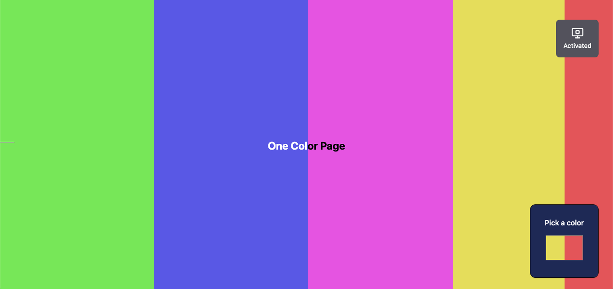

# One Color Page

A single page for your favorite color.

## How can I use this site?

I'll give you some examples:
- As lamp for your studies
- Style your room with a color
- Play "Guess a color" with your friend
- As a lantern instead your phone LOL
- etc

## Contribuing

You can contribute with this project creating a issue or a pull request here on Github. I recommend that you explain all details and please unleast write in proper English.

> Made with a lot of effort by [Poveii](https://github.com/Poveii)
